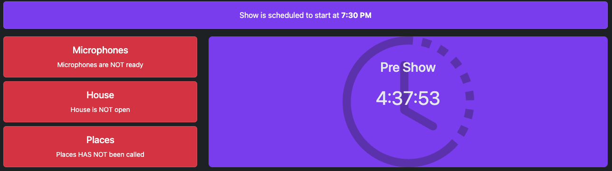
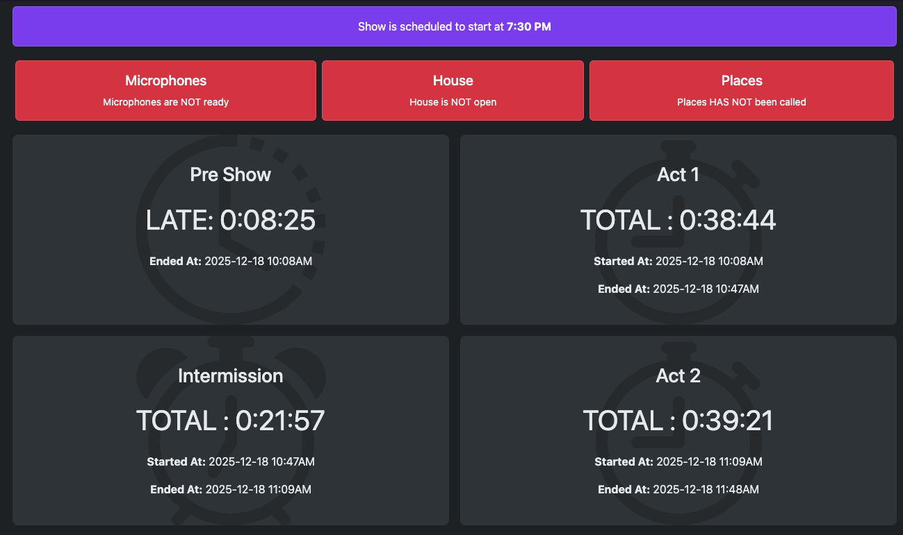

# theater-time-osc

OSC Version of a simple Theater Timer

## What it is

This is a simple timer that can keep track of a theater performance (or really any sequential event).  It outputs all of it's data via OSC and via a simple web interface.  Interaction is completely OSC message based.

## Configuration file

Configuration is handled via a toml file. A Sample is included below.

```toml
# Pedigree

title = "Title of the Show or Maybe Company"
subtitle = "Title of the Show or a subtitle"

# OSC Input and Output
# The port to listen on (localhost)
oscListenPort      = 4488

# The address and port to send to (can be localhost, so long as ports do not match)
oscSendAddress     = "192.168.10.170" 
oscSendPort        = 4444

oscSendSwitch      = true # Send switches as strings (1 argument)
oscSendToggle      = true # Send switches as toggles (2 arguments)
oscSendActiveTimer = true # Send the active timer
oscSendTimerStatus = true # Send all timer status(es)
oscBlinkExpiredTimer = true # Blink the timer text off for 1 second in 3 if the count down minutes or time is past.

# Local HTTP port to listen on
httpPort   = 2222

# Switch definitions - you can have as many as you want, they are numbered sequentially as they appear
#
# Title: name of the switch
# onText: Text to use when on
# offText: Text to use when off (default state)
[[switches]]
title = "Microphones"
onText = "Microphones are READY"
offText = "Microphones are NOT ready"

# Timer definitions - you can have as many as you like, but `start_countdown` type can only be used once, and first.
#
# title :: Name of the timer
# extras :: extra information to display for the timer (web interface only), as an array
# reset_switches = [""] :: The title of switch(es) to reset to off when timer starts.
#
# TYPES:
# start_countdown = true  :: Countdown to the time listed in the command line invocation
# count_up = true :: Count up from when the timer is active
# count_minutes = INTEGER :: Count down from the given number of minutes

[[timers]]
title = "Pre Show"
start_countdown = true
extras = [
    "Bar Ready?",
    "House Manager Ready?",
]

[[timers]]
title = "Act 1"
count_up = true

[[timers]]
title = "Intermission"
count_minutes = 15
reset_switches = ["Places"]

[[timers]]
title = "Act 2"
count_up = true
```

## OSC Interaction

### Switches

Switches are zero padded, and are numbered 01 - ?? based on your configuration file.

- `/theaterTime/switch/##/on`
  - Turn switch ## on
- `/theaterTime/switch/##/off`
  - Turn switch ## off
- `/theaterTime/switch/##/toggle`
  - Toggle switch ##

### Timers

Timers do not have direct access, they are a stack

- `/theaterTime/timer/next`
  - Deactivate current timer and activate next
- `/theaterTime/timer/previous`
  - Deactivate current timer and activate previous
- `/theaterTime/timer/stop`
  - Stop all timers

## OSC Output - Switches

All switches are sent when configured on.  They arrive in the following format for toggles:

`/theaterTime/toggle/## [string:arg1] [string:arg2]`

- Argument 1: onText if switch is on, empty otherwise
- Argument 2: offText if switch is off, empty otherwise

They arrive in the following format for switches:

`/theaterTime/switch/## [string:arg1]`

- Argument 1: onText if switch is on, offText if switch is off

## OSC Output - Timers

All timers can be sent.  It is up to the end user to decipher the results.

`/theaterTime/timer/## [string:title] [int:isOn]`

- Argument 1: timer title
- Argument 2: 0/1 if the timer is running

You can also get the active timer

`/theaterTime/currentTimer [int:time] [string:title] [string:time] [string:arrow]`

- Argument 1: time elapsed, in seconds. Count down timers are negative, hitting 0 at the "end" point
- Argument 2: title of running timer
- Argument 3: Pretty printed time in hours:minutes:seconds, for countdown type timers a "+" will be added to the front of the string if the target time is past
- Argument 4: Direction of the timer, ↑ or ↓ depending on configuration

## Web Interface

The web interface has two modes, a simple version:



Or a more detailed "administrator" version (append `admin.html` to the hostname:port address):



## Install, build, and run

You'll need node and npm installed.  Be sure to refresh the npm dependencies.

`# npm install`

To run, create a toml file, and provide a date and time a the command line - date is ISO8601 (YYYY-MM-DD) and time is zero padded 24 hour. (HH:MM)

`# npm start shows/my_show.toml 2025-12-18 19:30`

## License

Do whatever you like with this code. If it might be helpful to others, maybe open a pull request.
