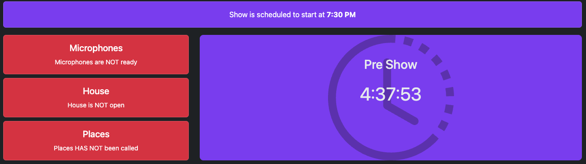
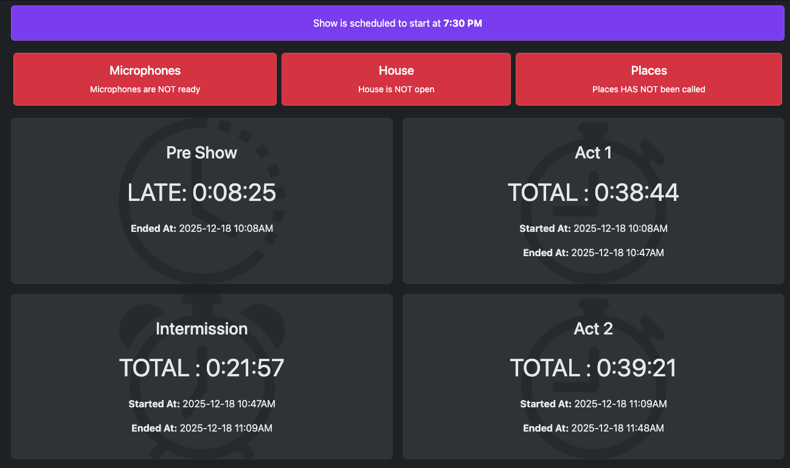

# theater-time-osc

Simple Theater Timer for Events and Shows

## What it is

This is a simple timer that can keep track of a theater performance (or really any sequential event).  It outputs all of it's data via OSC and via a simple web interface.  Interaction is completely OSC message based.  OSC output is specifically tailored to work well with [Vor](https://www.getvor.app/)

## Features

- Countdown to absolute time timers (show start)
- Countup from zero timers (Acts, Scenes, whatever)
- Countdown to an absolute number of minutes (intermissions)
- Toggle switches that can optionally be tied to timers (places, house open, etc)
- Audio feedback on the main process for switches and countdown timers ("10 Minutes, please"; "This is your places call")

## Audio Notes

Audio works without alteration on Mac and Windows, and is included in a way that if it fails, the process should continue without an issue. Currently, the web interface does __not__ play audio, but if someone needs this functionality, it should be pretty simple to implement.

## Configuration file

Configuration is handled via a toml file. Annotated Sample is included below.  A Full sample from the author's theater is in `sample.config.toml`

### Pedigree

- _title_ : String
- _subtitle_ : String

```toml
[show]
title    = "Sample Theater"
subtitle = "Sample Show"
```

### OSC Input and Output

- _listenPort_ : the port TheaterTime listens on (all interfaces)
- _sendAddress_ and _sendPort_ : the port/address TheaterTime sends messages to
- _sendSwitch_ : send switch state messages
- _sendToggle_ : send switch state messages as toggles (see below)
- _sendActiveTimer_ : send the running timer
- _sendTimerStatus_ : send all timers
- _blinkExpired_ : when a timer is expired (countdown style), blink the text at around 0.33Hz (on for 2 seconds, off for 1)

```toml
[osc]
listenPort        = 4488
sendAddress       = "127.0.0.1"
sendPort          = 4444
sendSwitch        = true
sendToggle        = true 
sendActiveTimer   = true
sendTimerStatus   = true
blinkExpired      = true
```

### Audio

Audio is played by the server process.

- _use_ : a boolean, setting to false disables audio output
- _volume_ is on a 0->1.0 scale
- _timer\_##_ is the file played at ## minutes remaining for countdown type timers

```toml
[audio]
use      = true
volume   = 0.5
timer_05 = '5min.wav'
timer_10 = '10min.wav'
timer_15 = '15min.wav'
timer_20 = '20min.wav'
timer_30 = '30min.wav'
```

### Local HTTP port to listen on

```toml
httpPort   = 2222
```

### SWITCHES

Switches are ON/OFF Data points.  They can be "forced" off by a timer starting or another switch being turned on.

- _title_, _onText_, and _offText_ : strings.
- _isOn_ : start a switch in the already "ON" state
- _audioFile_ : will be played when the switch is toggled on
- _resetSwitches_ : will toggle the named (title) switch OFF when that switch if turned on
- _reverseColor_ : reverses the traffic light color - green for OFF, red for ON

```toml
[[switches]]
title   = "Microphones"
onText  = "Microphones are READY"
offText = "Microphones are NOT ready"
audioFile     = "mics.wav"
resetSwitches = []
reverseColor  = false
```

### TIMERS

Timers are the nuts and bolts of this package

- `startCountDown = true` can appear once, and must be first.  This timer type counts down to a known date & time, supplied at the command line.  It can be altered later via OSC commands
- `countUp = true` can appear any number of times, it starts from zero and counts up until stopped.
- `countMinutes = ##` can appear any number of times, it counts down a known number of minutes from when it is started.

- _title_ : a string
- _extras_ : can appear on any timer type, and just gives extra info - it only appears in the administrative web view.
- _resetSwitches_ : can appear in any timer type, and resets those switch titles to their OFF state when the timer is started.

```toml
[[timers]]
title = "Pre Show"
start_countdown = true
extras = [
    "Bar Ready?",
    "House Manager Ready?",
]

[[timers]]
title = "Act 1"
count_up = true

[[timers]]
title = "Intermission"
count_minutes = 15
reset_switches = ["Places"]

[[timers]]
title = "Act 2"
count_up = true
```

## OSC Interaction

### Switches

Switches are zero padded, and are numbered 01 - ?? based on your configuration file.

- `/theaterTime/switch/##/on`
  - Turn switch ## on
- `/theaterTime/switch/##/off`
  - Turn switch ## off
- `/theaterTime/switch/##/toggle`
  - Toggle switch ##

### Timers

Timers do not have direct access, they are a stack

- `/theaterTime/timer/next`
  - Deactivate current timer and activate next
- `/theaterTime/timer/previous`
  - Deactivate current timer and activate previous
- `/theaterTime/timer/stop`
  - Stop all timers

### Update Details / Reset

- `/theaterTime/reset`
  - Reset all switches and timers to initial state
- `theaterTime/update/start [days] [hours] [minutes]`
  - Change the start date (first absolute countdown timer) target - days/hours/minutes is an integer value, positive or negative.
- `theaterTime/update/title [new title]`
  - Change the title of the event
- `theaterTime/update/subtitle [new subtitle]`
  - Change the subtitle of the event

## OSC Output - Switches

All switches are sent when the OSC configuration is set to send.  They arrive in the following format for toggles:

`/theaterTime/toggle/## [string:arg1] [string:arg2]`

- Argument 1: onText if switch is on, empty otherwise
- Argument 2: offText if switch is off, empty otherwise
- Argument placement is reversed for reverseColor switches.

They arrive in the following format for switches:

`/theaterTime/switch/## [string:arg1]`

- Argument 1: onText if switch is on, offText if switch is off

## OSC Output - Timers

All timers can be sent.  It is up to the end user to decipher the results.

`/theaterTime/timer/## [string:title] [int:isOn]`

- Argument 1: timer title
- Argument 2: 0/1 if the timer is running

You can also get the active timer

`/theaterTime/currentTimer [int:time] [string:title] [string:time] [string:arrow]`

- Argument 1: time elapsed, in seconds. Count down timers are negative, hitting 0 at the "end" point
- Argument 2: title of running timer
- Argument 3: Pretty printed time in hours:minutes:seconds, for countdown type timers a "+" will be added to the front of the string if the target time is past
- Argument 4: Direction of the timer, ↑ or ↓ depending on configuration
- If `blinkExpired` is turned on, the last 3 arguments will be empty strings 1 in 3 seconds.

## Web Interface

The web interface has two modes, a simple version:



Or a more detailed "administrator" version (append `admin.html` to the hostname:port address):



## Install, build, and run

You'll need node and npm installed.  Be sure to refresh the npm dependencies.

`# npm install`

To run, create a toml file, and provide a date and time a the command line - date is ISO8601 (YYYY-MM-DD) and time is zero padded 24 hour. (HH:MM)

`# npm start shows/my_show.toml 2025-12-18 19:30`

If for some reason the server process exits, and you want to pick up where you left off, you can start with no arguments, and the last saved state will be resumed.  Note that timers are based on timestamps, so the server exiting does not pause a timer.

`# npm start`

## License

Do whatever you like with this code. If it might be helpful to others, maybe open a pull request.
